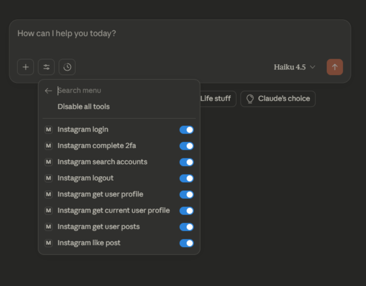

# Insta MCP Server


MCP (Model Context Protocol) server for Instagram integration.


## Installation for MCP Clients

This MCP server can be used with MCP-compatible clients like Claude Desktop and Cursor IDE. Follow the instructions below to configure the server in your client.

### Prerequisites

- Node.js 18+ or 20+ installed
- Instagram account credentials (`IG_USERNAME` and `IG_PASSWORD`)

### For Claude Desktop

1. **Locate your Claude Desktop configuration file:**
   - **macOS:** `~/Library/Application Support/Claude/claude_desktop_config.json`
   - **Windows:** `%APPDATA%\Claude\claude_desktop_config.json`
   - **Linux:** `~/.config/Claude/claude_desktop_config.json`

2. **Open the configuration file** (create it if it doesn't exist) and add the following to the `mcpServers` section:

```json
{
  "mcpServers": {
    "mcp-instagram": {
      "command": "npx",
      "args": [
        "-y",
        "mcp-instagram"
      ],
      "env": {
        "IG_USERNAME": "your_instagram_username",
        "IG_PASSWORD": "your_instagram_password"
      }
    }
  }
}
```

3. **Replace the credentials:**
   - Replace `your_instagram_username` with your Instagram username
   - Replace `your_instagram_password` with your Instagram password

4. **Restart Claude Desktop** for the changes to take effect.
And you should see the Instagram MCP server in the list of available tools.
<p align="center">
  
  
</p>

### For Cursor IDE

1. **Locate your Cursor MCP configuration file:**
   - Workspace config: `.cursor/mcp.json` (in your project root)
   - Global config: `~/.cursor/mcp.json`

2. **Open the configuration file** (create it if it doesn't exist) and add the following to the `mcpServers` section:

```json
{
  "mcpServers": {
    "mcp-instagram": {
      "command": "npx",
      "args": [
        "-y",
        "mcp-instagram"
      ],
      "env": {
        "IG_USERNAME": "your_instagram_username",
        "IG_PASSWORD": "your_instagram_password"
      }
    }
  }
}
```

3. **Replace the credentials:**
   - Replace `your_instagram_username` with your Instagram username
   - Replace `your_instagram_password` with your Instagram password

4. **Restart Cursor** for the changes to take effect.

### Alternative: Using Local Installation

If you've cloned the repository locally, you can use the absolute path instead:

```json
{
  "mcpServers": {
    "mcp-instagram": {
      "command": "npx",
      "args": [
        "-y",
        "/absolute/path/to/mcp-instagram"
      ],
      "env": {
        "IG_USERNAME": "your_instagram_username",
        "IG_PASSWORD": "your_instagram_password"
      }
    }
  }
}
```

**Note:** Replace `/absolute/path/to/mcp-instagram` with the actual absolute path to your cloned repository.

### Security Notes

- **Never commit your credentials** to version control
- The `env` section in the MCP configuration is the recommended way to provide credentials
- Credentials are never requested from the LLM - they must be provided via environment variables
- If you have 2FA enabled on your Instagram account, you'll need to complete the 2FA flow using the `instagram_complete_2fa` tool after initial login

### Verifying Installation

After restarting your MCP client, you should see the Instagram MCP server in the list of available servers. You can verify it's working by asking the AI assistant to use Instagram tools like:

**Authentication:**
- `instagram_login` - Login to Instagram account
- `instagram_complete_2fa` - Complete two-factor authentication
- `instagram_logout` - Logout from Instagram

**Profile & Content Viewing:**
- `instagram_search_accounts` - Search for Instagram accounts
- `instagram_get_user_profile` - Get user profile information by ID or username
- `instagram_get_current_user_profile` - Get authenticated user's own profile
- `instagram_get_user_posts` - Get paginated feed of a user's posts
- `instagram_get_post_details` - Get detailed information about a specific post
- `instagram_get_user_stories` - Get active stories from a user
- `instagram_get_timeline_feed` - Get home feed (posts from accounts you follow)

**Engagement Actions:**
- `instagram_like_post` - Like a post or reel
- `instagram_like_comment` - Like a comment
- `instagram_comment_on_post` - Add a comment to a post or reply to a comment
- `instagram_get_post_comments` - Get comments for a post

**Social Actions:**
- `instagram_follow_user` - Follow an Instagram user
---


## ⚠️ Legal Disclaimer and Risks

**IMPORTANT: READ BEFORE USE**

This software utilizes unofficial Instagram API access methods and is not affiliated with, endorsed by, or supported by Meta Platforms, Inc. (Instagram). By using this MCP server, you acknowledge and agree to the following:

### Risks and Limitations

1. **Account Restrictions:** Use of this software may result in your Instagram account being flagged for suspicious or automated activity. Instagram may issue warnings, temporarily restrict account functionality, or permanently suspend or delete your account.

2. **No Guarantees:** The functionality of this software is not guaranteed and may cease to work at any time due to changes in Instagram's platform, security measures, or policies.

### Limitation of Liability

THE AUTHOR(S) AND CONTRIBUTOR(S) OF THIS SOFTWARE PROVIDE IT "AS IS" WITHOUT WARRANTY OF ANY KIND, EXPRESS OR IMPLIED. IN NO EVENT SHALL THE AUTHOR(S) BE HELD LIABLE FOR ANY CLAIM, DAMAGES, OR OTHER LIABILITY, WHETHER IN AN ACTION OF CONTRACT, TORT, OR OTHERWISE, ARISING FROM, OUT OF, OR IN CONNECTION WITH THE SOFTWARE OR THE USE OF THE SOFTWARE, INCLUDING BUT NOT LIMITED TO:

- Instagram account suspensions, restrictions, or deletions
- Loss of data, content, or access to Instagram services
- Any direct, indirect, incidental, special, consequential, or punitive damages

**BY USING THIS SOFTWARE, YOU ACCEPT FULL RESPONSIBILITY FOR ANY CONSEQUENCES THAT MAY RESULT FROM ITS USE. USE AT YOUR OWN RISK.**

### Recommendations

- Use a secondary or test Instagram account rather than your primary account
- Monitor your account for any warnings or unusual activity
- Implement reasonable rate limiting and usage patterns to minimize detection risk
- Regularly review Instagram's Terms of Service and comply with all applicable laws and regulations

**TL;DR:** It's just common sense, really. Don't go liking 10,000 posts in an hour or following everyone on the planet. Instagram doesn't like robots pretending to be humans. Be cool, don't overdo it, and you'll probably be fine. Probably.

